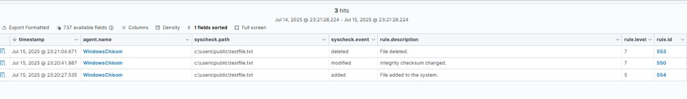
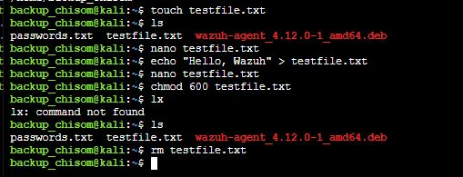
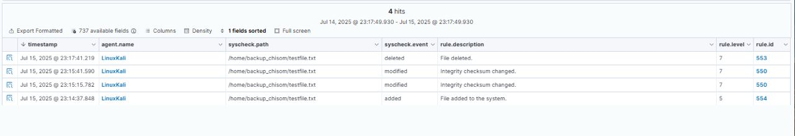

# Checks.md

Checks.md contains commands used to test that your configuration is working.

## FIM

To test that your FIM is working, run these:

**Windows:** 

Navigate to a monitored directory: i.e, `cd C:\Users\Public`
create a test file: `New-Item -Path ".\testfile.txt" -ItemType "File"`
Check that your file creation was successful with `ls`
You should see all files in that folder listed, including testfile.txt

To modify it. which triggers a file modification event on your FIM:
`Set-Content -Path ".testfile.txt" -Value "This is a test file."`

To delete it, which triggers a file deletion on FIM:
`Remove-Item .\testfile.txt`

Confirm with `ls`, testfile.txt will no longer be there.

Now, head to your Wazuh Dashboard, under File Monitoring, you should see something like this: 

**Linux**

Follow the commands in this image: 

Once you are done, navigate to File Integrity Monitoring on your Linux Endpoint and check for something like this: 

